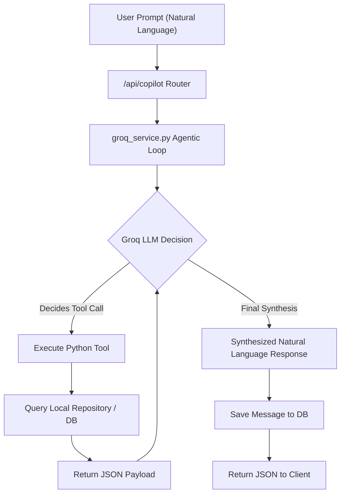
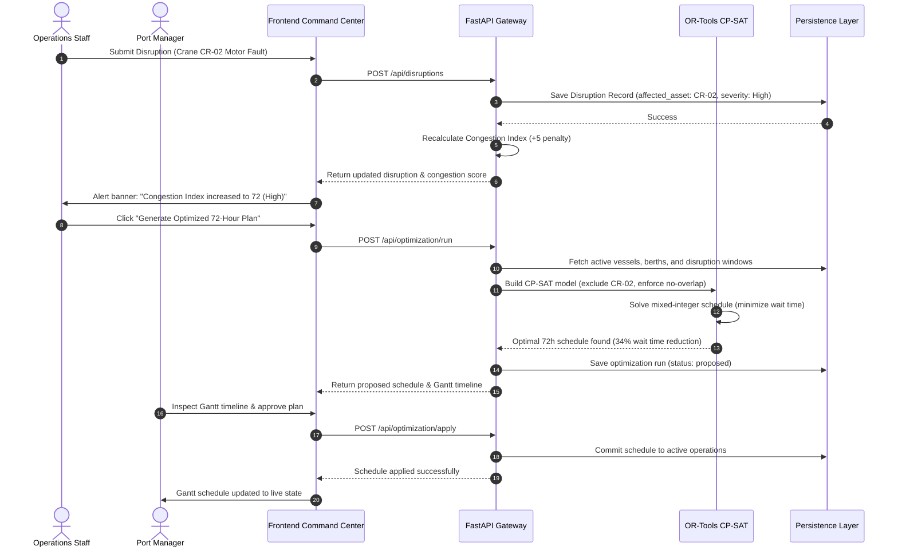

# Technical Architecture: NaviOps Smart Port Optimization Platform

---

## 1. System Architecture Overview

NaviOps is engineered as a decoupled, high-performance web and optimization platform designed for mission-critical port operations. It cleanly separates the **Operational Telemetry & Ingestion Plane**, the **Combinatorial Mathematical Optimization Engine**, the **Agentic Conversational AI Layer**, and the **Relational Persistence Layer**.

```mermaid
graph TD
    subgraph Client_Layer ["Client Layer (Next.js 14 / TypeScript / Tailwind CSS)"]
        UI_Dashboard["Overview Command Center (/)"]
        UI_Gantt["72h Optimization & Gantt (/optimization)"]
        UI_Ops["Operations Dispatch (/operations)"]
        UI_Vessels["Fleet & Anchorage Queue (/vessels)"]
        UI_Berths["Berth Terminal Matrix (/berths)"]
        UI_Cranes["STS Crane Management (/cranes)"]
        UI_Yards["Yard Stacking Blocks (/yards)"]
        UI_Disruptions["Disruption Logging (/disruptions)"]
        UI_Users["User Directory & RBAC Admin (/users)"]
        UI_Copilot["Bob Copilot Chat Interface (/copilot)"]
    end

    subgraph Backend_Gateway ["Backend Gateway (FastAPI / Python 3.11 / Pydantic v2)"]
        API_Auth["Auth & RBAC Middleware (JWT / PBKDF2)"]
        API_Router["REST API Gateway (10 Resource Routers)"]
        Svc_Congestion["Rule-Based Congestion Engine (0-100)"]
    end

    subgraph Optimization_Engine ["Combinatorial Optimization (Google OR-Tools)"]
        CPSAT_Model["CP-SAT Integer Programming Solver"]
        Constraints_Spatial["Physical Compatibility (Length & Draft)"]
        Constraints_Interval["No-Overlap Interval Constraints"]
        Constraints_Crane["STS Crane Rate & Moves Bandwidth"]
        Objective_Wait["Priority-Weighted Waiting Time Minimizer"]
    end

    subgraph AI_Copilot_Layer ["Agentic AI Copilot (Groq LPUs / openai/gpt-oss-120b)"]
        Agent_Loop["5-Round Agentic Tool-Calling Loop"]
        Tool_Registry["9 Live Operational Tools + 1 Action Tool"]
        Conv_Manager["Conversation & Memory Manager"]
    end

    subgraph Persistence_Layer ["Data Persistence (Dual-Mode: SyncedTable + Supabase PostgreSQL)"]
        DB_Users[("users (RBAC)")]
        DB_Vessels[("vessels (14)")]
        DB_Berths[("berths (5)")]
        DB_Cranes[("cranes (10)")]
        DB_Yards[("yards (5)")]
        DB_Disruptions[("disruptions (active)")]
        DB_Schedules[("schedules & optimization_runs")]
        DB_Conversations[("conversations & messages")]
    end

    %% Client to Backend
    UI_Dashboard -->|REST /api/dashboard| API_Router
    UI_Gantt -->|REST /api/optimization| API_Router
    UI_Disruptions -->|REST /api/disruptions| API_Router
    UI_Users -->|REST /api/auth/users| API_Router
    UI_Copilot -->|REST /api/copilot & /api/conversations| API_Router

    %% Backend internal flow
    API_Router --> API_Auth
    API_Router --> Svc_Congestion
    API_Router -->|Solve 72h Schedule| CPSAT_Model
    API_Router -->|Natural Language Query| Agent_Loop

    %% Optimization internal flow
    CPSAT_Model --> Constraints_Spatial
    CPSAT_Model --> Constraints_Interval
    CPSAT_Model --> Constraints_Crane
    CPSAT_Model --> Objective_Wait

    %% Copilot tool calls
    Agent_Loop --> Tool_Registry
    Tool_Registry -->|Read Telemetry| Persistence_Layer
    Tool_Registry -->|Propose Plan| CPSAT_Model

    %% Persistence
    API_Router <--> Persistence_Layer
    Conv_Manager <--> DB_Conversations
```



---

## 2. Component Breakdown & Responsibilities

### 2.1 Frontend Command Center (`src/frontend`)
- **Technology:** Next.js 14.2.5 (App Router), TypeScript 5, Tailwind CSS 3.4, Lucide React, Recharts.
- **Routing Structure:** 14 static and dynamic routes including:
  - `/` (Overview Dashboard with real-time KPI metrics, Congestion Gauge, and quick action drawers).
  - `/optimization` (72-hour Gantt chart, schedule generation, and delay analysis).
  - `/operations` (Consolidated operational dispatch view with live vessel cards).
  - `/vessels`, `/berths`, `/cranes`, `/yards` (Dedicated telemetry management tables).
  - `/disruptions` (Interactive incident logging and resolution interface).
  - `/copilot` (Conversational AI copilot with multi-turn session persistence).
  - `/users` (User directory, RBAC role management, and admin modal).
  - `/login` (Secure authentication portal).
- **State Management & Interactivity:** Client-side token management via cookies/localStorage, reactive modal dialogs, and real-time polling updates.

### 2.2 Backend API Gateway (`src/backend/app`)
- **Technology:** Python 3.11+, FastAPI 0.115+, Pydantic v2, Uvicorn ASGI.
- **Resource Routers:**
  1. `auth.py`: User authentication, registration, token refresh, and user role updates.
  2. `dashboard.py`: Consolidated terminal KPIs and congestion index breakdown.
  3. `vessels.py`: Vessel lifecycle management (ETA, ETD, priority, status).
  4. `berths.py`: Physical berth status, length/draft capacities, and assigned vessels.
  5. `cranes.py`: STS crane telemetry, moves/hour ratings, and maintenance states.
  6. `yards.py`: Yard block capacities, utilized TEUs, and density monitoring.
  7. `disruptions.py`: Incident logging, severity scoring, and active disruption resolution.
  8. `optimization.py`: OR-Tools solver execution, schedule retrieval, and plan approval.
  9. `copilot.py`: Groq-powered conversational endpoint with agentic tool loop.
  10. `conversations.py`: Multi-turn chat session creation, listing, history retrieval, and deletion.

### 2.3 Congestion Scoring Engine (`src/backend/app/services/congestion.py`)
- Calculates the deterministic Port Congestion Index ($0 \le \text{Index} \le 100$) using a multi-factor weighted algorithm:
  $$\text{Score} = \min\left(100, 0.35 \cdot R_{\text{anchorage}} + 0.25 \cdot U_{\text{berth}} + 0.25 \cdot S_{\text{crane}} + 0.15 \cdot D_{\text{yard}} + \sum P_{\text{disruptions}}\right)$$
- Normalizes individual components against rated operational capacities and appends incident severity penalties.

### 2.4 Mathematical Optimization Engine (`src/backend/app/optimization/optimizer.py`)
- Formulates the Berth Allocation Problem (BAP) and Quay Crane Assignment Problem (QCAP) as an integer programming constraint satisfaction model using **Google OR-Tools CP-SAT**.
- Solves across a 72-hour planning horizon in discrete 1-hour intervals.

### 2.5 Agentic AI Copilot Service (`src/backend/app/services/groq_service.py`)
- Connects to Groq's high-speed inference API (`openai/gpt-oss-120b`).
- Implements a 5-round agentic execution loop with 9 operational read tools and 1 confirmation-gated action tool.
- Maintains conversation history and executes live data queries against the local repository without hallucination.

### 2.6 Dual-Mode Data Persistence (`src/backend/app/core/database.py`)
- **Primary Mode (Offline / In-Memory):** Thread-safe `SyncedTable` repository pre-seeded with 14 vessels, 5 berths, 10 cranes, 5 yard zones, 3 active disruptions, and 3 RBAC user personas.
- **Secondary Mode (Production Cloud):** Supabase PostgreSQL client connected via `SUPABASE_URL` and `SUPABASE_KEY` when configured in the environment.

---

## 3. Google OR-Tools CP-SAT Mathematical Formulation

The scheduling engine solves a discrete-time mixed integer constraint programming model:

### 3.1 Sets & Parameters
- **Time Horizon:** $T = \{0, 1, 2, \dots, 71\}$ (72 one-hour discrete planning intervals).
- **Vessels:** Set $V$ of incoming and waiting vessels requiring service.
  - $ETA_v \in T$: Estimated time of arrival for vessel $v$.
  - $ETD_v \in T$: Target estimated time of departure for vessel $v$.
  - $Length_v$: Physical length overall (LOA) in meters.
  - $Draft_v$: Maximum required vessel draft in meters.
  - $Moves_v$: Container moves (lifts) required for cargo discharge/loading.
  - $Priority_v \in \{1, 2, 3, 4\}$: Cargo priority tier ($1 = \text{Critical}, 4 = \text{Low}$).
- **Berths:** Set $B$ of quayside berths.
  - $MaxLength_b$: Physical berth length in meters.
  - $MaxDraft_b$: Maximum water depth in meters.
  - $MaxCranes_b$: Maximum number of STS cranes serviceable simultaneously.
- **Cranes:** Set $C$ of operational STS gantry cranes with throughput rating $Rate_c$ (moves/hour).
- **Disruptions:** Set $D$ of active maintenance and incident windows $[T_{start}^d, T_{end}^d]$ affecting berth $b_d$ or crane $c_d$.

### 3.2 Decision Variables
- $B_{v, b} \in \{0, 1\}$: Binary assignment variable; equals 1 if vessel $v$ is berthed at berth $b$, 0 otherwise.
- $Start_v \in [ETA_v, 72]$: Integer variable representing the berthing start hour of vessel $v$.
- $Duration_{v, b}$: Integer service duration calculated based on cargo moves and assigned crane capacity:
  $$Duration_{v, b} = \left\lceil \frac{Moves_v}{\min(MaxCranes_b, 2) \cdot \overline{Rate}} \right\rceil$$
- $End_v = Start_v + \sum_{b \in B} (B_{v, b} \cdot Duration_{v, b})$: Berthing departure hour.
- $Interval_{v, b}$: Optional interval variable spanning $[Start_v, End_v]$ active if $B_{v, b} = 1$.

### 3.3 Constraints
1. **Single Berth Allocation:**
   $$\sum_{b \in Compatible(v)} B_{v, b} = 1 \quad \forall v \in V$$
2. **Physical Compatibility:**
   $$B_{v, b} = 0 \quad \text{if } Length_v > MaxLength_b \lor Draft_v > MaxDraft_b$$
3. **No-Overlap Quayside Constraints (Collision Prevention):**
   $$\text{model.AddNoOverlap}([Interval_{v, b} \mid v \in V]) \quad \forall b \in B$$
4. **Earliest Arrival Time:**
   $$Start_v \ge \max(ETA_v, \text{CurrentTime}) \quad \forall v \in V$$
5. **Disruption Inactivity Exclusion:**
   If berth $b$ has an active disruption during $[T_{start}^d, T_{end}^d]$, the solver enforces that no interval variable on berth $b$ overlaps with the disruption window:
   $$End_v \le T_{start}^d \quad \lor \quad Start_v \ge T_{end}^d \quad \forall v \text{ allocated to } b$$

### 3.4 Objective Function
$$\min \sum_{v \in V} \left[ w_{\text{priority}}(v) \cdot (Start_v - ETA_v) + \alpha \cdot \max(0, End_v - ETD_v) \right]$$

Where:
- $w_{\text{priority}}(1) = 5$ (Critical priority cargo receives $5\times$ penalty per hour of delay)
- $w_{\text{priority}}(2) = 3$ (High priority cargo receives $3\times$ penalty)
- $w_{\text{priority}}(3) = 2$ (Standard priority cargo receives $2\times$ penalty)
- $w_{\text{priority}}(4) = 1$ (Low priority cargo receives $1\times$ penalty)
- $\alpha = 2$ (Penalty factor for departure tardiness past contracted ETD)

---

## 4. Agentic AI Copilot Architecture & Tooling Matrix

**Bob Copilot** uses Groq's high-speed LPU infrastructure to run a controlled, stateful tool-calling agent. The agent cannot hallucinate port telemetry because every operational claim requires executing an approved tool against the live repository.




### 4.1 Operational Tool Registry

| Tool Name | Type | Input Parameters | Responsibility |
|---|---|---|---|
| `get_dashboard_summary` | Read | *None* | Returns high-level terminal metrics: total fleet, waiting count, berthed count, active berths, operating cranes, yard density, and current congestion score. |
| `get_congestion_status` | Read | *None* | Returns the detailed Congestion Index breakdown (0–100), operational status band, factor contributions, and active disruption penalties. |
| `get_waiting_vessels` | Read | *None* | Returns all vessels currently at anchorage awaiting berth assignment, ordered by arrival time and priority. |
| `get_vessels` | Read | `status?: string` | Queries vessels filtered by operational status (`Anchorage`, `Berthed`, `In Transit`, `Departed`). |
| `get_berths` | Read | `status?: string` | Queries quayside berths filtered by status (`Available`, `Occupied`, `Maintenance`). |
| `get_cranes` | Read | `status?: string` | Queries STS gantry cranes filtered by status (`Operational`, `Assigned`, `Maintenance`). |
| `get_yard_capacity` | Read | *None* | Returns storage utilization, capacity, and density percentage across all terminal yard blocks. |
| `get_active_disruptions` | Read | *None* | Returns all currently active operational incidents, weather alerts, equipment faults, and affected assets. |
| `get_latest_optimization_plan` | Read | *None* | Returns the most recent 72-hour CP-SAT optimization result, including vessel start/end times and delay metrics. |
| `run_optimization` | Action | `reason: string` | Triggers a candidate 72-hour CP-SAT optimization run and generates a structured summary for human operator review and confirmation. |

---

## 5. Security & Role-Based Access Control (RBAC)

### 5.1 Authentication Architecture
- **Password Hashing:** NIST-compliant PBKDF2-HMAC-SHA256 with 100,000 iterations and a 16-byte cryptographically secure random salt.
- **Session Tokens:** JSON Web Tokens (JWT) signed with HMAC-SHA256 (`HS256`), carrying user identifier, email, role, and expiration timestamp.
- **API Guarding:** FastAPI dependency injection enforces authentication via `get_current_user`, with role authorization guards `require_admin` and `require_ops`.

### 5.2 RBAC Permission Matrix

| Operation / API Route | Port Manager / Admin | Operations Staff | Executive Viewer |
|---|:---:|:---:|:---:|
| `GET /api/dashboard/*` (KPIs, Congestion) | Allowed | Allowed | Allowed |
| `GET /api/vessels`, `GET /api/berths`, etc. | Allowed | Allowed | Allowed |
| `POST /api/vessels`, `PUT /api/vessels/*` | Allowed | Allowed | Restricted (403) |
| `DELETE /api/vessels/*` | Allowed | Restricted (403) | Restricted (403) |
| `POST /api/disruptions` (Report Incident) | Allowed | Allowed | Restricted (403) |
| `PUT /api/disruptions/{id}/resolve` | Allowed | Allowed | Restricted (403) |
| `POST /api/optimization/run` (Compute Plan) | Allowed | Allowed | Restricted (403) |
| `POST /api/optimization/apply` (Lock Plan) | Allowed | Restricted (403) | Restricted (403) |
| `POST /api/copilot/chat` (Conversational AI) | Allowed | Allowed | Allowed |
| `POST /api/auth/users` (Create User) | Allowed | Restricted (403) | Restricted (403) |
| `PUT /api/auth/users/{id}/role` (Update Role) | Allowed | Restricted (403) | Restricted (403) |

---

## 6. End-to-End Operational Sequences

### 6.1 Disruption Injection & Re-Optimization Sequence



---

## 7. Repository File & Architectural Mapping

```
d:/-bob-ai-hackathon-Catalyst/
├── src/
│   ├── backend/
│   │   ├── app/
│   │   │   ├── api/
│   │   │   │   ├── auth.py              # JWT authentication & user administration
│   │   │   │   ├── dashboard.py         # Terminal KPIs & congestion breakdown
│   │   │   │   ├── vessels.py           # Vessel fleet endpoints
│   │   │   │   ├── berths.py            # Berth status & allocation endpoints
│   │   │   │   ├── cranes.py            # STS crane telemetry endpoints
│   │   │   │   ├── yards.py             # Yard block density endpoints
│   │   │   │   ├── disruptions.py       # Incident logging & resolution
│   │   │   │   ├── optimization.py      # CP-SAT scheduling endpoints
│   │   │   │   ├── copilot.py           # Bob Copilot Groq chat endpoint
│   │   │   │   └── conversations.py     # Multi-turn chat persistence
│   │   │   ├── core/
│   │   │   │   ├── config.py            # Pydantic environment configuration
│   │   │   │   ├── database.py          # Dual-mode SyncedTable & Supabase client
│   │   │   │   └── security.py          # PBKDF2 password hashing & JWT tokens
│   │   │   ├── models/
│   │   │   │   └── schemas.py           # Pydantic v2 schemas for all entities
│   │   │   ├── optimization/
│   │   │   │   └── optimizer.py         # Google OR-Tools CP-SAT formulation
│   │   │   └── services/
│   │   │       ├── congestion.py        # 0-100 Congestion Index calculation
│   │   │       ├── groq_service.py      # Agentic Groq tool loop & 10 tools
│   │   │       ├── port_repo.py         # In-memory repository with synthetic data
│   │   │       └── conversation_repo.py # Multi-turn conversation persistence
│   │   ├── tests/                       # 157 pytest automated unit/integration tests
│   │   ├── requirements.txt             # Backend Python dependencies
│   │   └── .env.example                 # Environment template
│   ├── frontend/
│   │   ├── src/
│   │   │   ├── app/                     # Next.js 14 App Router (14 pages)
│   │   │   ├── components/              # Reusable UI cards, tables, Gantt, modals
│   │   │   └── lib/                     # API client, auth context, TypeScript types
│   │   ├── package.json                 # Frontend dependencies & scripts
│   │   └── tailwind.config.js           # Styling configuration
│   └── database/
│       ├── schema.sql                   # Supabase PostgreSQL DDL
│       └── seed.sql                     # Baseline synthetic seed data
└── docs/                                # Technical documentation
    ├── problem-statement.md
    ├── solution-overview.md
    ├── architecture.md
    └── setup-guide.md
```
